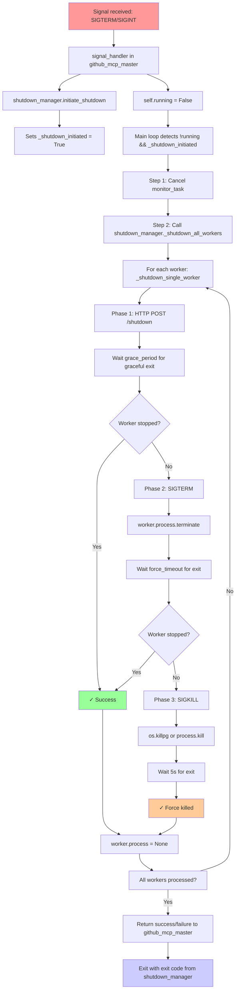

# Shutdown Flow Analysis & Consolidation Plan

## Current Shutdown Flow Overview

This document analyzes the complete shutdown procedure in the GitHub Agent codebase, identifies redundancies, and proposes consolidation improvements.

## Current Architecture

The shutdown process involves two main components:
- `github_mcp_master.py` - Application-level shutdown orchestration
- `shutdown_manager.py` - Comprehensive shutdown coordination system

## Detailed Current Flow



## Step-by-Step Breakdown

### 1. Signal Reception
**Location:** `github_mcp_master.py:463-480`
```python
def signal_handler(self, signum: int, frame: Any) -> None:
    signal_name = signal.Signals(signum).name
    logger.info(f"🚨 Received signal {signum} ({signal_name}), initiating graceful shutdown...")
    
    self.running = False
    self.shutdown_manager.initiate_shutdown(f"signal_{signal_name}")
```

### 2. Shutdown Initiation
**Location:** `shutdown_manager.py:785-792`
```python
def initiate_shutdown(self, reason: str = "manual") -> bool:
    self._shutdown_initiated = True
    self._shutdown_reason = reason
    return True
```

### 3. Main Loop Detection
**Location:** `github_mcp_master.py:535-543`
```python
while self.running and not self.shutdown_manager._shutdown_initiated:
    await asyncio.sleep(0.1)

logger.info("🛑 Shutdown signal received, beginning coordinated shutdown...")
```

### 4. Manual Orchestration in github_mcp_master
**Location:** `github_mcp_master.py:552-570`

**Step 1:** Cancel health monitoring
```python
monitor_task.cancel()
await monitor_task  # Wait for cancellation
```

**Step 2:** Shutdown workers using shutdown_manager
```python
return await self.shutdown_manager._shutdown_all_workers(
    grace_period=3.0, force_timeout=5.0
)
```

### 5. Worker Shutdown Process
**Location:** `shutdown_manager.py:1111-1199`

Each worker goes through a **3-phase shutdown**:

#### Phase 1: HTTP Graceful Shutdown
```python
async with aiohttp.ClientSession() as session:
    async with session.post(f"http://localhost:{worker.port}/shutdown") as response:
        # Send HTTP shutdown request
        
# Wait grace_period for graceful exit
grace_end = time.time() + grace_period
while time.time() < grace_end and worker.is_running():
    await asyncio.sleep(0.5)
```

#### Phase 2: SIGTERM
```python
worker.process.terminate()
await asyncio.wait_for(
    self._wait_for_process_exit(worker.process),
    timeout=force_timeout
)
```

#### Phase 3: SIGKILL (Force Kill)
```python
# Try process group kill first
os.killpg(os.getpgid(worker.process.pid), signal.SIGKILL)
# Fallback to single process kill
worker.process.kill()

await asyncio.wait_for(
    self._wait_for_process_exit(worker.process),
    timeout=5.0
)
```

## Current Issues & Redundancies

### 1. **Duplicate Shutdown Coordination**
- `github_mcp_master.py` has its own 2-step shutdown orchestration
- `shutdown_manager.py` has a comprehensive 4-phase shutdown process:
  1. **Workers** shutdown
  2. **Client** disconnection  
  3. **Resource** cleanup
  4. **Verification** phase

**Problem:** github_mcp_master only uses Phase 1 (workers), skipping the other phases

### 2. **Redundant Signal Handling**
- `github_mcp_master.py` sets up signal handlers (lines 497-498)
- `shutdown_manager.py` also has signal handling capabilities
- Both get triggered, causing duplicate logging

### 3. **Incomplete Shutdown Usage**
```python
# github_mcp_master.py only calls:
await self.shutdown_manager._shutdown_all_workers(grace_period=3.0, force_timeout=5.0)

# But shutdown_manager.py has full shutdown available:
await self.shutdown_manager.shutdown(grace_period=10.0, force_timeout=5.0)
```

### 4. **Duplicate Worker Tracking**
- `github_mcp_master.py` maintains `self.workers: dict[str, WorkerProcess]`
- `shutdown_manager.py` maintains `self._workers: dict[str, WorkerProcess]`
- Both need to be kept in sync manually

### 5. **Split Responsibility**
```python
# Current flow splits responsibility:
github_mcp_master.py:
  - Signal handling
  - Health monitoring cancellation  
  - Worker shutdown initiation

shutdown_manager.py:
  - Worker shutdown execution
  - Exit code management
  - (Unused) Client/Resource cleanup
```

## Proposed Simplifications

### Option 1: Full Delegation to ShutdownManager
**Recommended approach**

```python
# github_mcp_master.py simplified to:
async def start(self) -> bool:
    # Setup and worker startup...
    
    # Delegate ALL shutdown handling to shutdown_manager
    return await self.shutdown_manager.run_until_shutdown()

# shutdown_manager.py handles:
class ShutdownManager:
    async def run_until_shutdown(self) -> bool:
        # Wait for signal
        # Execute full 4-phase shutdown
        # Return with proper exit code
```

### Option 2: Unified Signal Handling
```python
# Remove signal handlers from github_mcp_master.py
# Let shutdown_manager handle all signals directly
# github_mcp_master just calls: await shutdown_manager.shutdown()
```

### Option 3: Single Worker Registry
```python
# Remove duplicate worker tracking
# github_mcp_master.py uses shutdown_manager._workers directly
# No more manual sync between self.workers and shutdown_manager._workers
```

## Benefits of Consolidation

1. **Reduced Complexity:** Single shutdown orchestrator instead of two
2. **Complete Shutdown:** Use all 4 phases (workers, clients, resources, verification)  
3. **Consistent Logging:** Unified shutdown logging and progress tracking
4. **Better Error Handling:** Comprehensive exit code management
5. **Easier Testing:** Single shutdown path to test
6. **Maintenance:** Less code duplication to maintain

## Implementation Priority

**High Priority:**
- [ ] Remove duplicate signal handling
- [ ] Use full `shutdown_manager.shutdown()` instead of just `_shutdown_all_workers`
- [ ] Eliminate manual worker sync between classes

**Medium Priority:**  
- [ ] Consolidate worker tracking to single source
- [ ] Move health monitoring cancellation into shutdown_manager

**Low Priority:**
- [ ] Full delegation of shutdown orchestration
- [ ] Remove github_mcp_master shutdown logic entirely

## Current Status

✅ **Completed:** Consolidated duplicate `_wait_for_process_exit` implementations  
✅ **Completed:** Worker registration sync between github_mcp_master and shutdown_manager  
🔄 **In Progress:** Analysis of remaining consolidation opportunities  
⏳ **Pending:** Implementation of proposed simplifications

---

**Note:** This analysis was performed after successfully consolidating the duplicate shutdown code and confirming all tests pass with the current simplified implementation.
