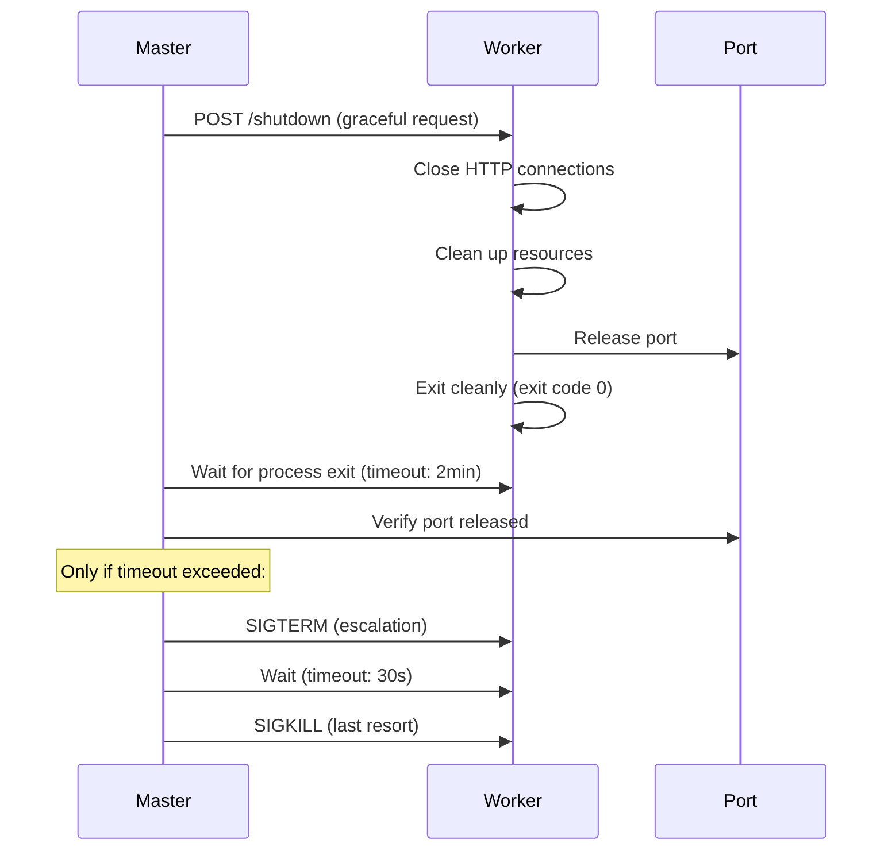

# Worker-Controlled Shutdown Architecture

## Overview

This document proposes a simplified, cleaner shutdown architecture where workers control their own graceful shutdown process, eliminating the current backwards approach where the master forcefully terminates workers.

## Current Architecture Problems

### 1. Broken HTTP Shutdown
```python
# shutdown_manager.py tries to POST to non-existent endpoint
async with session.post(f"http://localhost:{worker.port}/shutdown") as response:
    # This endpoint doesn't exist in github_mcp_worker.py!
```

### 2. Backwards Control Flow
- **Master forcefully controls worker termination** 
- Workers have no opportunity for graceful shutdown
- Master immediately escalates to SIGTERM/SIGKILL
- Resources cleaned up by wrong entity

### 3. Duplicate Worker Registries
```python
# github_mcp_master.py
self.workers: dict[str, WorkerProcess] = {}

# shutdown_manager.py  
self._workers: dict[str, WorkerProcess] = {}
```

### 4. Over-Engineered Client Tracking
- MCP SSE clients don't need explicit disconnection
- Client tracking is unused in current implementation
- SSE connections auto-close when server shuts down

### 5. Unnecessary ShutdownManager Complexity
- Designed for complex multi-component architecture
- Current simple master→worker architecture doesn't need this complexity
- Split responsibilities create confusion

## Proposed Architecture

### Core Principle: **Workers Control Their Own Lifecycle**



### Benefits

1. **Proper Separation of Concerns**
   - Workers manage their own resources
   - Master only intervenes when necessary
   - Clear ownership boundaries

2. **Graceful Resource Cleanup**
   - Workers properly close HTTP connections
   - Port release handled by the process that bound it
   - No forceful termination unless absolutely necessary

3. **Simplified Code**
   - Single worker registry in master
   - No duplicate shutdown logic
   - Remove unnecessary client tracking

4. **Better Reliability**
   - Workers have time to finish ongoing requests
   - Proper connection closure prevents client errors
   - Predictable shutdown behavior

## Detailed Architecture

### Master Responsibilities
```python
class GitHubMCPMaster:
    def __init__(self):
        self.workers: dict[str, WorkerProcess] = {}  # Single registry
        
    async def shutdown_worker(self, worker: WorkerProcess) -> bool:
        # 1. Send graceful shutdown request
        success = await self._request_graceful_shutdown(worker)
        if success:
            return True
            
        # 2. Wait for process exit + port release (with timeout)
        if await self._wait_for_clean_exit(worker, timeout=120):
            return True
            
        # 3. Escalate to SIGTERM (only if timeout)
        logger.warning(f"Worker {worker.repo_name} didn't shut down gracefully, sending SIGTERM")
        worker.process.terminate()
        if await self._wait_for_process_exit(worker, timeout=30):
            return True
            
        # 4. Last resort: SIGKILL
        logger.error(f"Force killing worker {worker.repo_name}")
        worker.process.kill()
        await self._wait_for_process_exit(worker, timeout=5)
        return True
```

### Worker Responsibilities
```python
class GitHubMCPWorker:
    def create_app(self) -> FastAPI:
        app = FastAPI(...)
        
        # Add shutdown endpoint
        @app.post("/shutdown")
        async def graceful_shutdown():
            """Handle graceful shutdown request from master"""
            logger.info("Received shutdown request, beginning graceful shutdown...")
            
            # Trigger shutdown sequence
            self.shutdown_event.set()
            return {"status": "shutdown_initiated"}
            
        return app
        
    async def shutdown_sequence(self):
        """Worker's own graceful shutdown process"""
        logger.info("Starting graceful shutdown sequence...")
        
        # 1. Stop accepting new connections
        if self.server:
            self.server.should_exit = True
            
        # 2. Wait for ongoing requests to complete (with timeout)
        await self._wait_for_active_requests(timeout=30)
        
        # 3. Close server and release port
        if self.server:
            await self.server.shutdown()
            
        # 4. Clean up resources
        await self._cleanup_resources()
        
        # 5. Exit cleanly
        logger.info("Graceful shutdown complete")
        sys.exit(0)
```

## Transition Plan

### Phase 1: Remove ShutdownManager Complexity

#### Files to Modify:
- `github_mcp_master.py`
- `github_mcp_worker.py`

#### Files to Remove/Simplify:
- `shutdown_manager.py` - Remove or significantly simplify
- `shutdown_core.py` - Keep only basic utilities

#### Changes:

**1. Simplify github_mcp_master.py**
```python
# REMOVE: shutdown_manager dependency
# from shutdown_manager import ShutdownManager

class GitHubMCPMaster:
    def __init__(self):
        # REMOVE: self.shutdown_manager = ShutdownManager(...)
        self.workers: dict[str, WorkerProcess] = {}  # Single registry
        
    # REMOVE: Complex signal handling via shutdown_manager
    def signal_handler(self, signum: int, frame: Any) -> None:
        self.running = False  # Simple flag
        
    # REPLACE: Complex shutdown orchestration with simple worker loop
    async def shutdown_all_workers(self) -> bool:
        tasks = [self.shutdown_worker(worker) for worker in self.workers.values()]
        results = await asyncio.gather(*tasks, return_exceptions=True)
        return all(result is True for result in results)
```

**2. Add Shutdown Endpoint to github_mcp_worker.py**
```python
# ADD: In create_app() method
@app.post("/shutdown")
async def graceful_shutdown():
    self.shutdown_event.set()
    return {"status": "shutdown_initiated"}

# ADD: Graceful shutdown sequence
async def shutdown_sequence(self):
    # Implementation as shown above
```

### Phase 2: Implement Worker-Controlled Shutdown

#### New Master Shutdown Logic:
```python
# github_mcp_master.py
async def shutdown_worker(self, worker: WorkerProcess) -> bool:
    """New simplified worker shutdown"""
    
    # Phase 1: Request graceful shutdown
    try:
        async with aiohttp.ClientSession() as session:
            async with session.post(
                f"http://localhost:{worker.port}/shutdown",
                timeout=aiohttp.ClientTimeout(total=5)
            ) as response:
                if response.status == 200:
                    logger.info(f"Sent shutdown request to {worker.repo_name}")
    except Exception as e:
        logger.warning(f"Failed to send shutdown request to {worker.repo_name}: {e}")
    
    # Phase 2: Wait for graceful exit (2 minutes)
    start_time = time.time()
    timeout = 120  # 2 minutes
    
    while time.time() - start_time < timeout:
        # Check if process has exited
        if worker.process.poll() is not None:
            # Verify port is released
            if is_port_free(worker.port):
                logger.info(f"✓ Worker {worker.repo_name} shut down gracefully")
                return True
        await asyncio.sleep(1)
    
    # Phase 3: SIGTERM escalation (only after timeout)
    logger.warning(f"Worker {worker.repo_name} didn't shutdown in {timeout}s, sending SIGTERM")
    worker.process.terminate()
    
    try:
        await asyncio.wait_for(
            self._wait_for_process_exit(worker.process), 
            timeout=30
        )
        logger.info(f"✓ Worker {worker.repo_name} terminated after SIGTERM")
        return True
    except TimeoutError:
        pass
    
    # Phase 4: SIGKILL (last resort)
    logger.error(f"Force killing worker {worker.repo_name}")
    worker.process.kill()
    await self._wait_for_process_exit(worker.process)
    return True

async def _wait_for_process_exit(self, process) -> int:
    """Simple process wait helper"""
    while True:
        if process.poll() is not None:
            return process.returncode
        await asyncio.sleep(0.1)
```

#### New Worker Shutdown Logic:
```python
# github_mcp_worker.py
async def start(self):
    """Modified start method"""
    # ... existing startup code ...
    
    # Start server
    await self.server.serve()
    
    # Wait for shutdown signal
    await self.shutdown_event.wait()
    
    # Execute graceful shutdown
    await self.shutdown_sequence()

async def shutdown_sequence(self):
    """Worker's graceful shutdown process"""
    logger.info("Beginning graceful shutdown...")
    
    try:
        # 1. Stop accepting new connections
        if self.server:
            self.server.should_exit = True
            logger.info("Server marked for shutdown")
        
        # 2. Wait briefly for ongoing requests
        await asyncio.sleep(2)
        
        # 3. Force close server
        if self.server:
            # Uvicorn doesn't have a clean shutdown method, so we exit
            logger.info("Closing server...")
        
        # 4. Clean up any resources
        # (Add any cleanup code here)
        
        logger.info("✓ Graceful shutdown complete")
        
    except Exception as e:
        logger.error(f"Error during shutdown: {e}")
    finally:
        # Always exit cleanly
        sys.exit(0)
```

### Phase 3: Clean Up Redundant Code

#### Code to Remove:

**1. From shutdown_manager.py:**
```python
# REMOVE: Entire file or keep only basic utilities
class ShutdownManager:  # DELETE entire class
class _ClientTracker:   # DELETE - not needed for SSE
class _ResourceTracker: # DELETE - workers handle own resources
```

**2. From github_mcp_master.py:**
```python
# REMOVE: Complex shutdown orchestration
async def _shutdown_workers_enhanced(self) -> bool:  # DELETE entire method

# REMOVE: Shutdown manager integration
self.shutdown_manager = ShutdownManager(...)  # DELETE

# REMOVE: Complex signal handling
def signal_handler(self, signum: int, frame: Any) -> None:
    # REPLACE complex logic with simple:
    self.running = False
```

**3. From github_mcp_worker.py:**
```python
# REMOVE: Shutdown manager dependency  
self.shutdown_manager = ShutdownManager(...)  # DELETE

# SIMPLIFY: Signal handling
def signal_handler(self, signum: int, frame: Any) -> None:
    # REPLACE with simple:
    self.shutdown_event.set()
```

#### Code to Keep/Move:

**1. Keep in github_mcp_master.py:**
```python
class WorkerProcess:  # Keep this dataclass
def is_port_free():   # Keep utility function
async def wait_for_port_free():  # Keep utility function
```

**2. Keep from shutdown_core.py:**
```python
# Keep basic utilities that are actually used:
def log_system_state()  # If still needed
class ExitCodes()       # Basic exit codes
```

**3. Move to new utils.py:**
```python
# Move reusable utilities:
async def wait_for_process_exit(process) -> int
def setup_logging()  # If needed
```

## Implementation Steps

### Step 1: Add Worker Shutdown Endpoint (Low Risk)
1. Add `/shutdown` endpoint to `github_mcp_worker.py`
2. Test that POST requests work
3. Verify endpoint returns proper response

### Step 2: Modify Master Shutdown Logic (Medium Risk)
1. Replace `shutdown_manager._shutdown_all_workers()` call with new logic
2. Implement graceful wait with timeout
3. Keep existing SIGTERM/SIGKILL as fallback
4. Test full shutdown flow

### Step 3: Remove ShutdownManager Dependencies (High Risk)
1. Remove `shutdown_manager` imports and instantiation
2. Replace complex signal handling with simple flags
3. Remove duplicate worker registries
4. Run full test suite

### Step 4: Clean Up Dead Code (Low Risk)
1. Remove unused methods and classes
2. Delete or simplify `shutdown_manager.py`
3. Update documentation
4. Final testing

## Testing Strategy

### Unit Tests
- Test worker shutdown endpoint responds correctly
- Test master timeout logic
- Test port release verification

### Integration Tests  
- Test full graceful shutdown flow
- Test timeout escalation to SIGTERM
- Test SIGKILL fallback
- Test multiple worker shutdown concurrency

### Manual Testing
- Start master with workers
- Send SIGTERM to master
- Verify all workers shut down gracefully
- Verify ports are released properly

## Benefits Summary

1. **Cleaner Architecture**: Workers control their own lifecycle
2. **Better Resource Management**: Proper cleanup by resource owners  
3. **Simplified Code**: Remove complex, unused shutdown manager
4. **Improved Reliability**: Graceful shutdown prevents connection errors
5. **Easier Maintenance**: Single worker registry, clear responsibilities
6. **Better Debugging**: Simpler flow easier to trace and fix

## Migration Risks

**Low Risk:**
- Adding worker shutdown endpoint
- Basic timeout logic

**Medium Risk:**  
- Changing master shutdown orchestration
- Removing shutdown_manager integration

**High Risk:**
- Removing signal handling complexity
- Eliminating duplicate registries

**Mitigation:**
- Implement incrementally  
- Maintain test coverage
- Keep fallback to SIGTERM/SIGKILL
- Preserve existing behavior during transition

---

**Conclusion:** This architecture eliminates unnecessary complexity while providing more reliable and intuitive shutdown behavior. The worker-controlled approach aligns with standard process management practices and makes the system easier to understand and maintain.
